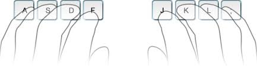

# The Home Row

---

* Each finger rests on a home row key.
* From left to right: 'asdf' 'jkl;'.
* Left index finger on 'f'.
* Right index finger on 'j'.
* Keep the thumbs free to hit spacebar.
* Fingers return to their assigned key after typing.

---

The 'f' and 'j' keys each have ridges on them.
These help you find the home row without looking down.
