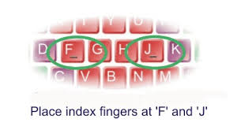
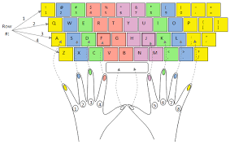

# Keys 'g' and 'h'

---

* Your left index finger rests on 'f'.
* Your right index finger rests on 'j'.

---

* Default finger position is the home row.
* Left index finger moves to 'g' then back to 'f'.
* Right index finger moves to 'h' then back to 'j'.
